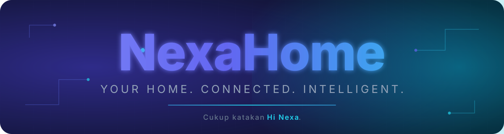

<div align="center">



<h3>Satu Pusat Kendali untuk Seluruh Rumah</h3>

<p>
Platform smart home open-source berbasis local-first dengan kendali perangkat melalui antarmuka web dan bahasa alami.
</p>

<p>
<a href="https://github.com/imaj2793/NexaHome">

</a>
<a href="#roadmap">

</a>
<a href="https://github.com/imaj2793/NexaHome/pulls">

</a>
<a href="LICENSE">

</a>
</p>

<p>


</p>

</div>

---

## Tentang NexaHome

**NexaHome** adalah platform **smart home open-source** yang dirancang sebagai pusat kendali untuk berbagai perangkat IoT di rumah, seperti lampu, sensor, AC, dan perangkat pintar lainnya.

Perangkat dapat dikendalikan melalui **antarmuka web** maupun **perintah menggunakan bahasa alami** melalui sistem AI.

Di dalam NexaHome terdapat **Nexa**, sebuah asisten AI yang memahami bahasa manusia dan berinteraksi dengan ekosistem NexaHome melalui mekanisme **tool calling**.

Nexa bukan LLM yang dilatih secara khusus. Nexa berfungsi sebagai penghubung antara bahasa manusia dan **NexaHome Core**, sedangkan Core bertanggung jawab terhadap autentikasi, otorisasi, kepemilikan perangkat, routing, serta eksekusi perintah.

> **Local-first · Modular · Provider-independent · Event-driven · Open-source**

---

## Mengapa NexaHome?

| Kemampuan | Penjelasan |
| --- | --- |
| **Kendali berbasis suara** | Kendalikan perangkat menggunakan bahasa alami melalui speech-to-text lokal dan AI-powered tool calling. |
| **Tool calling cerdas** | Nexa dapat mencari perangkat, memeriksa status, kemudian menjalankan beberapa tindakan berdasarkan satu perintah. |
| **Arsitektur perangkat universal** | Dirancang untuk mendukung berbagai vendor dan protokol tanpa mengikat Core pada satu ekosistem. |
| **Integrasi modular** | Integrasi baru dapat ditambahkan melalui kontrak `IntegrationAdapter` tanpa mengubah arsitektur utama. |
| **Local-first** | Data dan kontrol perangkat dapat berjalan secara lokal sehingga mengurangi ketergantungan terhadap layanan cloud. |
| **AI provider-independent** | Lapisan AI menggunakan abstraksi provider sehingga provider dapat diganti tanpa mengubah Core. |
| **Tanpa vendor lock-in** | Pengguna tetap memiliki kendali terhadap sistem dan perangkat yang digunakan. |

---

## Arsitektur

```text
Pengguna
   │
   │ Suara / Teks
   ▼
┌──────────────────────┐
│   Antarmuka Nexa     │
│    Web / Voice       │
└──────────┬───────────┘
           │
           ▼
┌──────────────────────┐
│    Speech-to-Text    │
│      whisper.cpp     │
└──────────┬───────────┘
           │
           ▼
┌──────────────────────┐
│       Nexa AI        │
│  DeepSeek / Provider │
└──────────┬───────────┘
           │
           │ Tool Calls
           ▼
┌──────────────────────┐
│    NexaHome Core     │
│ Auth · Routing ·     │
│ Authorization · State│
└──────────┬───────────┘
           │
           ▼
┌──────────────────────┐
│   Integration Layer  │
│ MQTT · Tasmota · mDNS   │
└──────────┬───────────┘
           │
           ▼
      Perangkat IoT
```

### Prinsip Utama

Nexa **tidak mengendalikan perangkat secara langsung**.

Nexa hanya meminta operasi melalui tool yang telah ditentukan. Selanjutnya, NexaHome Core melakukan validasi, menentukan integrasi yang sesuai, dan menjalankan operasi tersebut.

Pemisahan ini membuat:

- autentikasi dan otorisasi tetap berada di Core;
- kepemilikan perangkat tidak bergantung pada model AI;
- logika integrasi terisolasi;
- provider AI dapat diganti;
- kontrol perangkat lebih terprediksi dan dapat diaudit.

---

## Teknologi yang Digunakan

| Lapisan | Teknologi |
| --- | --- |
| **Frontend** | Next.js 15 · React 19 · TypeScript · Tailwind CSS 4 |
| **Backend** | NestJS 12 · Passport · JWT · WebSocket · Socket.IO |
| **Database** | PostgreSQL 16 · Prisma 6 |
| **AI** | `@nexahome/ai` · OpenAI-compatible Provider · DeepSeek · Mock Provider |
| **IoT** | MQTT · Tasmota HTTP · mDNS |
| **Device Core** | `@nexahome/device-core` |
| **Monorepo** | pnpm Workspaces · Turborepo |
| **Infrastruktur** | Docker Compose · PostgreSQL · MQTT Broker |
| **Speech Recognition** | whisper.cpp |
| **Komunikasi Realtime** | WebSocket · Socket.IO |

---

## Fitur

### Autentikasi

- Registrasi dan login
- Autentikasi berbasis JWT
- Kepemilikan berdasarkan home
- Proteksi operasi perangkat

### Manajemen Perangkat

- Menyalakan dan mematikan perangkat
- Mengatur tingkat kecerahan
- Mengatur warna
- Mengatur suhu
- Memantau status perangkat

### Ruangan dan Scene

- Mengelompokkan perangkat berdasarkan ruangan
- Mengatur beberapa perangkat sekaligus
- Membuat scene yang dapat digunakan kembali
- Menjalankan beberapa aksi melalui satu perintah

### Otomasi

- Aksi berdasarkan jadwal
- Trigger otomatis
- Beberapa aksi dalam satu workflow
- Pengendalian perangkat secara otomatis

### Pemantauan Energi

- Estimasi konsumsi daya
- Pencatatan penggunaan energi
- Pemantauan penggunaan berdasarkan kWh

### Notifikasi

- Peringatan sistem
- Aktivitas perangkat
- Event dari automation

### Nexa Visual

Nexa memiliki antarmuka visual dengan **delapan ekspresi** dan sinkronisasi status secara realtime menggunakan WebSocket.

---

## Nexa AI

Nexa menggunakan arsitektur AI berbasis **provider abstraction** sehingga provider AI dapat diganti tanpa mengubah logika utama NexaHome.

```text
Perintah Pengguna
       │
       ▼
Pemahaman Bahasa Alami
       │
       ▼
AI Provider
       │
       ▼
Pemilihan Tool
       │
       ▼
NexaHome Core
       │
       ▼
Integrasi Perangkat
       │
       ▼
Perangkat IoT
```

### Tool yang Tersedia

```text
get_devices
turn_on_device
turn_off_device
set_brightness
set_color
set_temperature
get_room_status
activate_scene
create_automation
get_energy_usage
```

Contoh perintah:

```text
"Nyalakan lampu kamar."
```

Nexa dapat mengidentifikasi perangkat yang sesuai dan menjalankan:

```text
get_devices
        ↓
turn_on_device
        ↓
NexaHome Core
        ↓
Lampu kamar menyala
```

Untuk perintah yang lebih kompleks:

```text
"Matikan lampu ruang tamu dan atur lampu kamar menjadi
30 persen."
```

Nexa dapat memecah permintaan tersebut menjadi beberapa tool call yang dijalankan melalui NexaHome Core.

---

## Alur Voice

Pipeline voice Nexa dirancang sebagai berikut:

```text
Mikrofon
   │
   ▼
Wake Word
   │
   ▼
whisper.cpp
   │
   ▼
Speech-to-Text
   │
   ▼
Nexa AI
   │
   ▼
Tool Calling
   │
   ▼
NexaHome Core
   │
   ▼
Perangkat IoT
   │
   ▼
Text-to-Speech
```

Speech recognition dirancang untuk berjalan secara lokal sehingga audio tidak harus dikirim ke layanan cloud eksternal.

### Konfigurasi Environment

```env
# AI Provider
AI_PROVIDER="deepseek"
AI_API_KEY="sk-..."
AI_BASE_URL="https://api.deepseek.com/v1"
AI_MODEL="deepseek-chat"

# Local Speech-to-Text
WHISPER_BIN="whisper-cli"
WHISPER_MODEL="/path/to/ggml-base.bin"
WHISPER_LANG="id"
```

Provider AI tetap dapat diganti melalui abstraksi provider tanpa mengubah NexaHome Core.

---

## Integrasi Perangkat

| Integrasi | Protokol | Cara ditemukan | Status |
| --- | --- | --- | --- |
| **MQTT** | MQTT broker |_TOPIC_ broadcast + state | Selesai |
| **Tasmota** | HTTP (`Status 11`) | mDNS `_tasmota._tcp`, atau manual | Selesai |
| **Universal Discovery** | mDNS | mDNS lintas vendor | Sebagian (mDNS saja) |
| SSDP / BLE | — | — | Riset |

Arsitektur integrasi menggunakan kontrak `IntegrationAdapter`. Integrasi baru
bisa ditambahkan tanpa mengubah business logic utama NexaHome Core.

### Cara menambah perangkat (scan yang jujur)

Scan **hanya menampilkan perangkat yang benar-benar ada di jaringan Anda**.
Tidak ada data simulasi: mode `mock` berarti "tidak ada koneksi", dan scan
di mode itu selalu kosong.

1. **MQTT** — perangkat (atau bridge Tasmota → MQTT) mengumumkan dirinya:

   ```bash
   docker compose exec mqtt mosquitto_pub -h 127.0.0.1 \
     -t 'nexahome/discovery' \
     -m '{"id":"relay_dapur","name":"Relay Dapur","type":"switch","capabilities":["power"],"state":{"power":false}}'
   ```

   Lalu buka **Devices → Scan**. Untuk<sup> state</sup> berkelanjutan, perangkat
   juga mengirim state berkala ke `nexahome/devices/<id>/state` dan menerima
   perintah di `nexahome/devices/<id>/set`.

2. **mDNS** — perangkat Tasmota/ESPHome/Shelly yang menyiarkan `_tasmota._tcp`
   dsb. Terlihat bila API berjalan di jaringan yang sama dengan perangkat
   (jalankan API secara native, atau Docker dengan `--network host` di Linux).
   Dari container bridge, multicast sering tidak menembus ke LAN.

3. **Manual** — **Devices → Add device** dengan nama, tipe, dan kapabilitas.
   Untuk Tasmota, isi IP perangkat agar status bisa dibaca.

> **Kenapa WiZ dihapus?** Protokol UDP WiZ (port 38899) hanya bekerja bila API
> berjalan langsung di jaringan lokal: dari container, broadcast keluar tetapi
> balasan unicast dari lampu tidak sampai (NAT). Karena tidak bisa diverifikasi
> dengan perangkat nyata, integrasi ini dihapus daripada menampilkan data
> palsu.

---

## Memulai Pengembangan

### Persyaratan

Pastikan perangkat pengembangan memiliki:

- Node.js
- pnpm
- PostgreSQL
- Git
- Docker (opsional)

### Instalasi

Clone repository:

```bash
git clone https://github.com/imaj2793/NexaHome.git
cd NexaHome
```

Install dependencies:

```bash
pnpm install
```

Salin konfigurasi environment:

```bash
cp .env.example apps/api/.env
```

Generate Prisma Client:

```bash
pnpm db:generate
```

Jalankan migration:

```bash
pnpm db:migrate
```

Isi database dengan data awal:

```bash
pnpm db:seed
```

Seed membuat akun owner, satu home, dan 3 ruangan — **tanpa perangkat palsu**.
Untuk mencoba UI dengan data demo yang jelas berlabel "(Demo)":

```bash
pnpm db:seed:demo        # pasang data demo
pnpm db:seed:demo:reset  # hapus lagi
```

```bash
# (opsional) seed dasar di dalam Docker:
docker compose run --rm migrate pnpm exec prisma db seed
```

Jalankan development server:

```bash
pnpm dev
```

### Instalasi Cepat dengan Docker

Untuk mencoba NexaHome tanpa setup Node.js, jalankan seluruh stack dengan satu perintah:

```bash
cp .env.example .env
# ganti JWT_SECRET dengan nilai acak:  openssl rand -hex 32
docker compose up -d --build
```

Dashboard tersedia di http://localhost:3000, API di http://localhost:3001/api.
Panduan lengkap (TLS, backup, upgrade, troubleshooting) ada di
[`docs/DEPLOYMENT.md`](docs/DEPLOYMENT.md).

### Layanan Lokal

| Layanan | Alamat |
| --- | --- |
| **Web** | http://localhost:3000 |
| **API** | http://localhost:3001/api |
| **Health Check** | http://localhost:3001/api/health |

### Akun Seed

<details>
<summary>Lihat kredensial</summary>

```text
Email:    owner@nexahome.local
Password: password123
```

</details>

> Kredensial tersebut hanya ditujukan untuk development lokal. Jangan gunakan kredensial default untuk deployment production.

---

## Struktur Proyek

```text
NexaHome/
├── apps/
│   ├── web/                 # Frontend Next.js
│   └── api/                 # Backend NestJS
│
├── packages/
│   ├── ai/                  # Abstraksi AI provider
│   ├── device-core/         # Kontrak perangkat dan integrasi
│   └── ...
│
├── docs/
│   ├── PRD.md               # Product Requirements
│   ├── ROADMAP.md           # Roadmap pengembangan
│   ├── DEVELOPMENT.md       # Panduan pengembangan
│   └── API.md               # Referensi API
│
├── BLUEPRINT.md             # Arsitektur teknis
├── IDEA.md                  # Konsep awal
└── README.md
```

---

## Dokumentasi

| Dokumen | Deskripsi |
| --- | --- |
| [`docs/PRD.md`](docs/PRD.md) | Visi produk, kebutuhan, dan definisi fitur |
| [`docs/ROADMAP.md`](docs/ROADMAP.md) | Tahapan pengembangan dan roadmap rilis |
| [`docs/DEVELOPMENT.md`](docs/DEVELOPMENT.md) | Panduan setup dan kontribusi teknis |
| [`docs/DEPLOYMENT.md`](docs/DEPLOYMENT.md) | Deployment produksi dengan Docker Compose |
| [`CONTRIBUTING.md`](CONTRIBUTING.md) | Cara berkontribusi dan konvensi |
| [`SECURITY.md`](SECURITY.md) | Cara melapor kerentanan |
| [`CODE_OF_CONDUCT.md`](CODE_OF_CONDUCT.md) | Peraturan interaksi komunitas |
| [`CHANGELOG.md`](CHANGELOG.md) | Riwayat perubahan versi |
| [`docs/API.md`](docs/API.md) | Referensi endpoint API |
| [`BLUEPRINT.md`](BLUEPRINT.md) | Arsitektur dan desain teknis |
| [`IDEA.md`](IDEA.md) | Konsep awal NexaHome |

---

## Roadmap

| Tahap | Lingkup | Status |
| --- | --- | --- |
| **1 — Foundation** | Monorepo, autentikasi, home, ruangan, perangkat, dashboard | Selesai |
| **2 — Smart Home** | Device Core, integrasi MQTT/Tasmota, WebSocket | Selesai |
| **3 — Nexa AI** | Provider abstraction, tool calling, TTS | Selesai |
| **4 — Visual Nexa** | Delapan ekspresi dan animasi realtime | Selesai |
| **5 — Automation** | Scene, scheduler, trigger, dan action | Selesai |
| **6 — IoT** | Integrasi MQTT + discovery berbasis topik | Selesai |
| **7 — Advanced** | Notifikasi dan pemantauan energi | Selesai |
| **8 — v1.0** | Dokumentasi dan security hardening | Selesai |
| **9 — Full Voice** | DeepSeek live, STT lokal, wake word | Dalam Pengembangan |
| **10 — Universal Onboarding** | mDNS, SSDP, dan Bluetooth discovery | Riset |

Informasi roadmap yang lebih lengkap tersedia di [`docs/ROADMAP.md`](docs/ROADMAP.md).

---

## Prinsip Pengembangan

NexaHome dibangun berdasarkan beberapa prinsip utama:

| Prinsip | Penjelasan |
| --- | --- |
| **Local-first** | Mengutamakan pemrosesan dan kontrol perangkat secara lokal jika memungkinkan. |
| **Modular** | Setiap komponen dirancang agar dapat dikembangkan atau diganti secara independen. |
| **Provider-independent** | Provider AI tidak boleh menentukan arsitektur inti sistem. |
| **Event-driven** | Perubahan status realtime dikomunikasikan melalui sistem event. |
| **Security by design** | Otorisasi dan kontrol perangkat berada di luar model AI. |
| **Open-source** | Sistem dirancang agar transparan, dapat dikembangkan, dan tetap berada di bawah kendali pengguna. |

---

## Kontribusi

Kontribusi terhadap NexaHome terbuka untuk siapa saja.

Sebelum membuat Pull Request:

1. Baca [`docs/DEVELOPMENT.md`](docs/DEVELOPMENT.md).
2. Ikuti struktur dan konvensi yang sudah digunakan.
3. Jalankan pemeriksaan TypeScript.
4. Jalankan production build.
5. Pastikan perubahan terdokumentasi jika diperlukan.
6. Jelaskan tujuan dan dampak teknis dari perubahan.

Untuk perubahan arsitektur atau fitur besar, disarankan membuka issue terlebih dahulu agar rancangan dapat didiskusikan sebelum implementasi.

### Konvensi Commit

Gunakan format imperative lowercase:

```text
feat: add device discovery
fix: resolve websocket authentication
chore: update dependencies
refactor: simplify device adapter
docs: update development guide
```

### Verifikasi

Sebelum commit:

```bash
pnpm lint        # ESLint
pnpm typecheck   # tsc --noEmit
pnpm test        # Vitest (API + web)
pnpm build       # production build
```

---

## Lisensi

NexaHome dirilis menggunakan **[MIT License](LICENSE)**.

NexaHome dapat digunakan, dimodifikasi, dan didistribusikan kembali, termasuk untuk keperluan komersial, dengan tetap mengikuti ketentuan yang tercantum dalam lisensi.

---

<div align="center">

<p>
<strong>NexaHome</strong>
</p>

<p>
Your Home. Connected. Intelligent.
</p>

<p>
© 2026 <a href="https://github.com/imaj2793">imaj2793</a> · NexaHome Contributors
</p>

</div>